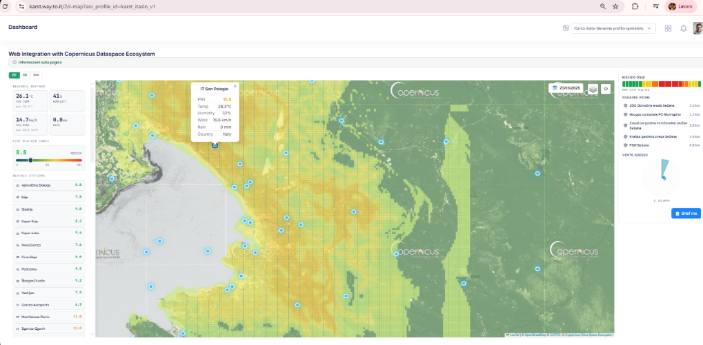
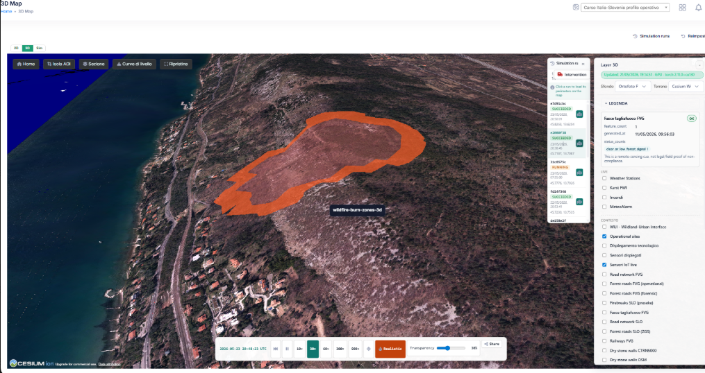
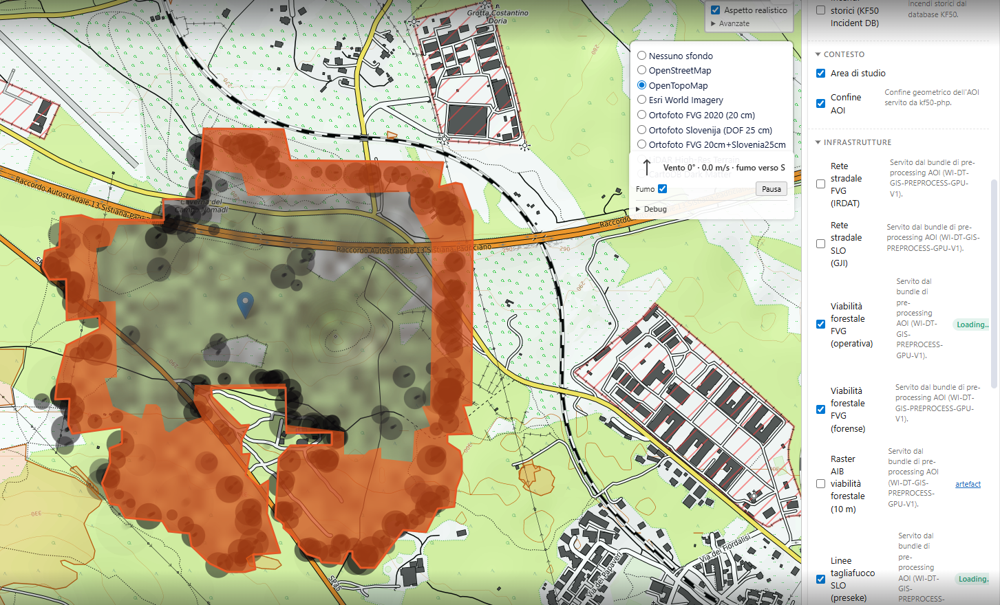
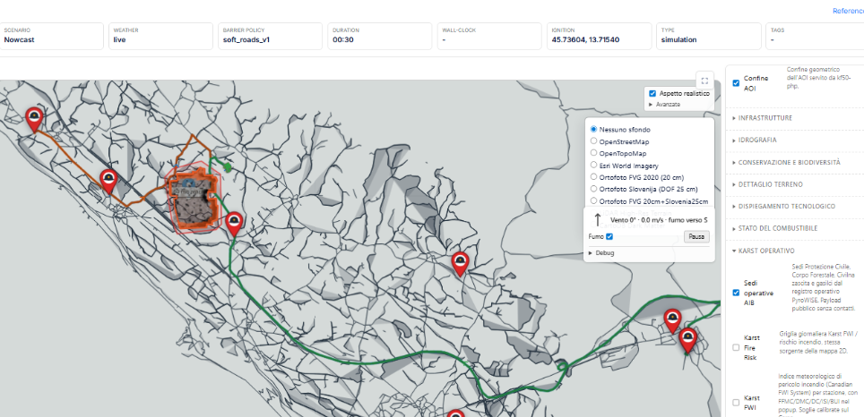

# Karst Firewall 5.0

  

> A cross-border answer to a cross-border fire — the EU Interreg VI-A Italy–Slovenia project for cross-border wildfire prevention.

This repository is the **public-facing documentation home** for the Karst Firewall 5.0 project: what we set out to do, who built it, what was delivered, and how to find each piece. The platform implementation lives in a family of **external repositories** (listed below); this repo is documentation only.

  

The **Karst Firewall 5.0** project is co-funded by the [Interreg VI-A Italy–Slovenia Programme](https://www.ita-slo.eu/en/karst-firewall-50). The official project page lists it as a standard project led by **Università IUAV di Venezia** with **6 partners**, running for **28 months** from **15 April 2024** to **14 August 2026**, with a total budget of **1,061,955.44 EUR** and **849,564.34 EUR** ERDF support. The programme [List of Operations](https://www.ita-slo.eu/sites/default/files/media/document/List-of-Operations__NOV_2025_EN.pdf) records project code **ITA-SI0600146**. The project develops cross-border wildfire prevention and governance capacity for the Karst region through ecosystem-based adaptation, satellite data, predictive AI, field sensing, simulation and support tools for first responders.

**Contact:** Infordata Sistemi Srl Società Benefit · Strada per Vienna 55/1 · 34151 Trieste (TS) · Italy

> **TerraWise project family.** Three repositories, three audiences:
>
> - **[`terrawise`](https://github.com/infordata-sistemi/terrawise)** — the product umbrella · architecture · modules · roadmap
> - **[`karst-firewall-50`](https://github.com/infordata-sistemi/karst-firewall-50)** — the first deployment · EU Interreg public docs &nbsp;← *you are here*
> - **[`pyrowise`](https://github.com/infordata-sistemi/pyrowise)** — the simulation engine · open scientific docs

---

## Quick links

| Audience | Where to go |
|---|---|
| **Citizens, municipalities, journalists** | [Live public portal — karst-map.way.to.it/portal](https://karst-map.way.to.it/portal) (IT · SL · EN · DE) |
| **Interreg programme** | [Official project page on ita-slo.eu](https://www.ita-slo.eu/en/karst-firewall-50) |
| **Project partners** | [PARTNERS.md](PARTNERS.md) |
| **Deliverables (D1.x / D2.x)** | [DELIVERABLES.md](DELIVERABLES.md) |
| **Methodology summary** | [METHODOLOGY.md](METHODOLOGY.md) |
| **Pilot sites on the ground** | [PILOTS.md](PILOTS.md) |
| **Scientific outputs + citations** | [PUBLICATIONS.md](PUBLICATIONS.md) |
| **Platform technical umbrella** | [`infordata-sistemi/terrawise`](https://github.com/infordata-sistemi/terrawise) |
| **Simulation engine — open science** | [`infordata-sistemi/pyrowise`](https://github.com/infordata-sistemi/pyrowise) |

---

### Karst Fire Weather Index (KFWI)

One of the project's main technical achievements is the **Karst Fire Weather Index (KFWI)**. KFWI improves on generic meteorological fire-danger mapping by combining a spatial-temporal ML ignition model with Karst-calibrated FWI severity. The model reports **77.5% fire detection** versus a **29% FWI-only baseline**, with a Random Forest ignition model at **AUC 0.934**. This matters in the Karst because **97.3% of fires occur below generic European "High" FWI thresholds**, so local calibration and ignition probability are essential for operational risk maps, nowcasts and intervention planning.

The KFWI service is implemented in the [`kf50-kfwi-api`](https://github.com/infordata-sistemi/kf50-kfwi-api) **external repository** (not in this docs repo). A plain-language summary of the method is in [METHODOLOGY.md](METHODOLOGY.md); the open scientific documentation for the simulation engine is in [`infordata-sistemi/pyrowise`](https://github.com/infordata-sistemi/pyrowise).

---

## Feature tour

> The screenshots below are from the **operational cockpit** — implemented in the [`kf50-php`](https://github.com/infordata-sistemi/kf50-php) repository, not here. They document what the project built; the source code lives in the external repos listed in [External resources](#external-resources).

The production cockpit at `karst.way.to.it` is organised around the cross-border Karst AOI (`karst_itaslo_v1`): situational awareness, simulation, intervention planning, observations, registry data and evidence workflows share the same AOI, weather and GIS-layer contracts.

### 1. 2D operational map — Karst FWI + ML risk context

- Leaflet 2D dashboard for the Italy–Slovenia Karst operational profile, with AOI-aware base layers and Copernicus Dataspace context.
- Karst FWI grid and daily fire-risk palette over the map, with station-level popups for FWI, temperature, humidity, wind and rain.
- ML-enriched risk context combining historical wildfire evidence, infrastructure exposure, operational assets and vulnerability zones.
- Live weather-station markers, nearby squads, wind rose, risk legend and "Brief me" handoff for operator summaries.
- Same AOI/layer contracts used by the simulator and 3D map, so 2D reconnaissance and run analysis speak the same geography.

### 2. 3D map — terrain, burn zones and run playback

- Cesium 3D terrain over FVG and Slovenian orthophoto sources, with AOI isolation, section tools, contour controls and reset/fly-to navigation.
- Wildfire burn zones, smoke and three-zone playback visualisation for loaded simulation runs.
- Run drawer with status, timestamps, ignition coordinates and one-click load into the 3D scene.
- Layer panel for live weather stations, Karst FWI, incidents, MeteoAlarm warnings, operational sites, deployed sensors, roads, firebreaks, railways and dry-stone-wall layers.
- High-resolution terrain/slope mode, share links, PNG/PDF evidence exports and 2D/3D/Sim mode switching.

### 3. Simulation run — PyroWISE nowcast and replay

- **PyroWISE**-backed nowcast, scenario and replay launcher with live/replay weather selection, ignition point, duration, time step and fuel mapping.
- Tiered barrier policies such as `soft_roads_v1` / `soft_with_highways_v1` to slow or block spread across roads, motorways and infrastructure layers without hard-clipping the fire front.
- Optional **dynamic fuel-state** toggle — feeds the run a satellite-derived (NDVI) vegetation-stress signal so the fire burns *today's* fuel; off by default, with a manifest badge when active (see [METHODOLOGY.md](METHODOLOGY.md)).
- Run metadata strip for weather source, policy, ignition, duration, wall-clock and simulation type.
- Streaming and fallback perimeter rendering, **ensemble** rendering (burn-probability surface + p10 / p50 / p90 arrival envelopes), arrival-time layers, realistic view toggle, smoke toggle and GIS-layer panel.
- Engineering/audit drawer, bookmarks, scenario handoff, share/export controls, QGIS-ready SHP perimeter export and run-bundle evidence for reproducibility.

> *PyroWISE is the simulation engine — a separate commercial product of Infordata Sistemi with [open scientific documentation](https://github.com/infordata-sistemi/pyrowise). Its source code is not in this docs repo or in `kf50-php`.*

### 4. Interventions — dispatch, ETA and staging support

- Operational-site layer for nearby agencies, fire brigades and civil-protection units across Italy and Slovenia.
- ETA ranking using site capability, distance, road assumptions and available vehicle data.
- Route picker with forest-road awareness, vehicle width checks, response-time tuning and route alternatives.
- Recommended staging point near the predicted fire front, with arrival margin and flank labelling.
- Dispatch modal with vehicles, crew, channel preview, confirmed/on-scene status and operator audit trail.

### 5. Weather-station log — AOI observations and FWI inputs

- AOI- and country-filtered weather readings ingested through the external **observation-ingest** service; the cockpit never queries the time-series store directly.
- Temperature, humidity, pressure, wind, rain and station-level FWI time series for ARSO, ARPA FVG, ARPA Veneto and related sources.
- Station history tables linked from map popups, station detail pages and simulation weather provenance.
- Weather provenance and threshold warnings used by simulation headline cards, warning banners and post-run station highlights.

### 6. Incidents — historical fire intelligence and reporting base

- Incident registry for active and historical wildfires, including location, timing, cause, vegetation, weather and damage/response fields.
- Burned-area statistics by month, country and year, plus current-year comparison against historical averages.
- Historical wildfire picker for simulation replay and calibration workflows.
- GIS-linked active incidents, historical fire perimeters and incident-derived layers for risk context.
- Foundation for the planned cross-border IT/SI incident-report autofill and cost-benefit analysis workflows.

### 7. IoT sensors — LoRaMIP and field telemetry

- LoRaMIP gateway and sensor inventory with auto-discovery, pending-approval workflow, map locations and gateway/sensor pairing.
- Per-reading history for MQTT-flushed cycles; resilience to ingest outages.
- Temperature, humidity, pressure, gas, SNR and RSSI charts, sparklines and trend arrows for quick health inspection.
- IoT freshness symbology in observation layers and 3D-map tooltips.
- Photo galleries, location pickers and integration with the unified Field Assets registry.
- Sensor firmware and the LoRa side live in the [`kf50-sensors`](https://github.com/infordata-sistemi/kf50-sensors) external repo.

### 8. Operations — registry, agencies, assets and GeoJSON feeds

- Operational registry for sites, agencies, assets, teams, contacts, sources and data-quality issues.
- Vehicle dimensions, photos, agency branding, headquarters data and country-aware registry filters.
- Excel export and data-quality audit workflow for missing coordinates, branding and vehicle specs.
- Public, operational and admin GeoJSON endpoints used by the 2D map, simulator and 3D map.
- Contact privacy rules keep public map layers contact-free while preserving authenticated operational views.

### Additional operational modules

- **Field Operations** — unifies IoT sensors, gateways, drones, thermal cameras, telecom radios, vehicles and other owned field hardware. Assets carry photos, lifecycle state, maintenance history and PyroWISE operation assignments.
- **Maintenance** — preventive, corrective, inspection, calibration, firmware and decommissioning events, with overdue badges and taxonomy-specific checklists.
- **OSINT** — FIRMS, Copernicus, authoritative civil-protection sources and PII-safe community signals; observations, correlation candidates and review queues.
- **Electronic-Nose Planner** — suggests **optimal positions for IoT electronic-nose ("e-nose VOC") gas sensors** over the active AOI with a scored coverage / risk / network / solar / maintenance model; produces QGIS-ready installation plans.
- **Electronic-Nose Network** — live e-nose sensor layer + alert triage with per-node status, history charts, and a per-alert evidence timeline.
- **Cockpit briefing** — role-aware live widgets for KPIs, active incidents, crews on duty, live feed, sensor health, prevention tasks, firebreak status and training.
- **Scenario Bricks** — reusable what-if recipes for ignition, horizon, ensemble, fuel state and model mode.
- **Evidence and sharing** — run links, PDFs, PNG snapshots, QGIS-ready SHP perimeter ZIPs and MinIO-backed artefact bundles support audit, briefing and research handoff.
- **MeteoAlarm cross-border weather warnings** — IT + SI public-warning feeds (MQTT realtime + REST reconciliation) drive the public-portal "active warning" banner and the operator alert pipeline.

---

## Agentic features — PyroTwin operator assistants

The platform ships a **PyroTwin agentic layer** on top of the operational cockpit: small, scoped AI assistants that read operational data, detect work that deserves attention, and either create operator-reviewable findings or propose tightly controlled actions. They do **not** replace the simulator, do not render the maps, and do not get direct database or storage access. Their purpose is to reduce operational backlog and make expert review faster while keeping the human operator, RBAC and audit trail in charge.

Seven capabilities ship in the cockpit ([source in `kf50-php`](https://github.com/infordata-sistemi/kf50-php)):

| Capability | What it does | Cadence |
|---|---|---|
| `smoke` | No-LLM canary — proves the tool surface + auth + lifecycle still work end-to-end after a deploy. | hourly |
| `research` | Weekly upgrade-scout — scans PyroWISE upstream + wildfire-sim projects (FARSITE / FlamMap / Cell2Fire / WindNinja), Copernicus EMS, Hugging Face, Eurostat / CMEMS / ESA. | Friday |
| `data_gap` | Monday warehouse sweep over allow-listed read-only SQL templates — flags high-signal gaps ranked by impact × effort. | Monday |
| `janitor` | Nightly housekeeping over `simulation_run` — proposes soft-deletes for orphan / test rows under tight approval gates. | nightly |
| `maintenance` | Nightly preventive-maintenance proposer over the Field Assets registry — clusters overdue assets by proximity and proposes scheduled events. | nightly |
| `alert_triage` | Hourly sweep over unresolved alerts older than 4 h — classifies each as `false_positive` / `duplicate` / `low` / `medium` / `high` / `critical`, drafts notifications for operator review. | hourly + webhook |
| `active_fire` | Active-fire trigger — sweeps NASA FIRMS (MODIS / VIIRS) detections in and near the AOI, clusters new hotspots, and **proposes** a PyroWISE nowcast per cluster for operator review. Propose-only: it never auto-launches a live simulation. | hourly / on FIRMS pass |

Every agent run, finding and proposed action is persisted in audit tables and surfaced in the cockpit's `/agentic/*` admin UI. Live writes need an explicit operator approval (or a matching pre-approved low-risk policy). Master kill-switch + per-capability budget knobs cap the layer well under €200 / month at default settings.

---

## External resources

This documentation repository does **not** contain any of the running platform's source code. Each capability lives in a dedicated external repository:

### Implementation repositories *(under `infordata-sistemi`)*

| Repo | Role | Built for KF5.0? |
|---|---|---|
| [`kf50-php`](https://github.com/infordata-sistemi/kf50-php) | Operator cockpit + public portal (Yii 2 / PHP 8 / MySQL) — the screens shown in the feature tour above. | ✅ Yes |
| [`kf50-observation-ingest`](https://github.com/infordata-sistemi/kf50-observation-ingest) | Validate + dedupe + route every observation (weather stations, IoT sensors, gateway heartbeats) into Influx (primary) and karst MySQL (inventory + fallback). | ✅ Yes |
| [`kf50-sensors`](https://github.com/infordata-sistemi/kf50-sensors) | IoT sensor + LoRaMIP gateway firmware and provisioning. | ✅ Yes |
| [`kf50-kfwi-api`](https://github.com/infordata-sistemi/kf50-kfwi-api) | The KFWI service — Karst-calibrated FWI severity + Random Forest ignition model. | ✅ Yes |
| [`kf50-seneh_ml`](https://github.com/infordata-sistemi/kf50-seneh_ml) | Sensor-network e-nose ML — classifies VOC signatures of early combustion against background air. | ✅ Yes |
| [`kf50-dji-bridge`](https://github.com/infordata-sistemi/kf50-dji-bridge) | Read-only DJI drone + dock telemetry ingest. | ✅ Yes |
| [`kf50-osrm`](https://github.com/infordata-sistemi/kf50-osrm) | Self-hosted OSRM routing for cross-border intervention dispatch (FVG + Slovenia). | ✅ Yes |

### Documentation repositories *(under `infordata-sistemi`)*

| Repo | Role |
|---|---|
| **`karst-firewall-50`** *(this repo)* | Public Interreg-facing documentation for the project. |
| [`terrawise`](https://github.com/infordata-sistemi/terrawise) | The **TerraWise** platform umbrella — what the technology *is* as a product, beyond this first Karst deployment. |
| [`pyrowise`](https://github.com/infordata-sistemi/pyrowise) | Open scientific documentation for the **PyroWISE** simulation engine (Rothermel + Huygens). |

### Pre-existing Infordata products used by the project *(developed before / outside KF5.0)*

The project also builds on technology and components Infordata had developed previously — they pre-date the project and are not part of its budgeted deliverables, but the cockpit and the simulation engine integrate with them:

| Component | Owner | Relationship to KF5.0 |
|---|---|---|
| [**PyroWISE simulation engine**](https://github.com/markopetelin/infordata-kf50-firegrowth) | Infordata Sistemi (commercial product) | The fire-spread simulator the cockpit talks to. KF5.0 funded the **integration** and the Karst-calibrated configuration; the engine itself is a pre-existing commercial product. See its [open scientific docs](https://github.com/infordata-sistemi/pyrowise) for the boundary between open methods and the commercial engine. |
| MinIO object store | (operational infrastructure) | Self-published GIS catalogue + run-bundle artefacts. |

### External public services the platform consumes

These are third-party services / data sources the project depends on but does not own. Listed here so the public boundary of *"what the Karst Firewall 5.0 project built"* is unambiguous:

| Service | Provider | Role |
|---|---|---|
| Copernicus Dataspace · Sentinel-2 / Sentinel-1 | EU Copernicus programme | Satellite imagery (NDVI, burn-scar mapping) |
| EFFIS | EU Joint Research Centre | Pan-European fire-danger forecasts (used for context only — the operational risk signal is the project's own KFWI) |
| FIRMS · MODIS · VIIRS | NASA | Active-fire / thermal-anomaly detection |
| ECMWF ERA5 | ECMWF | Atmospheric reanalysis baseline |
| ARSO observations | Slovenian Environment Agency | Weather + LiDAR (terrain/vegetation) |
| ARPA FVG · ARPA Veneto | Regional environmental agencies (IT) | Weather stations |
| AirQino | CNR-IBE / Florence | Low-cost air-quality sensor network (PM2.5, PM10, NO₂, O₃) around Duino-Aurisina |
| MeteoAlarm | EUMETNET | National-level severe-weather warnings (IT + SI) |
| EUMETSAT services · GURS DOF025 · FVG TrueOrtofoto | Various EU / national bodies | Imagery for the 3D twin |

The platform stays a **consumer** of these services — no data is mirrored beyond what is needed for situational awareness, and credentials/rate limits respect each provider's terms.

---

## Public portal

The live, citizen-facing portal — multilingual IT · SL · EN · DE — is online at **[karst-map.way.to.it/portal](https://karst-map.way.to.it/portal)**. It surfaces, in plain-language form, the project's main outputs:

- Live risk map · weather-station network · KFWI explainer + live data · air quality · e-nose early warning · wildfire history.
- The 3D twin · the simulator (with public access for citizens and researchers).
- About the project · partners · pilot sites · research results · the prevention playbook · the regulatory references.
- An accessible glossary of fire-weather and digital-twin terminology.

---

## Documentation in this repo

| File | Audience |
|---|---|
| [PARTNERS.md](PARTNERS.md) | Project consortium and associated partners |
| [DELIVERABLES.md](DELIVERABLES.md) | Index of WP1 / WP2 deliverables (D1.1.x, D2.x.x …) |
| [METHODOLOGY.md](METHODOLOGY.md) | The science behind the KFWI, the digital twin and the prevention playbook |
| [PILOTS.md](PILOTS.md) | What the two pilot municipalities are building on the ground |
| [PUBLICATIONS.md](PUBLICATIONS.md) | Project publications, presentations and citations |

---

## Licensing

This documentation is licensed under [CC BY 4.0](LICENSE) — share and adapt with attribution.

The platform implementation follows an **open-core** model across the external repositories listed above:

- **Core community platform code** — EUPL-1.2-or-later (open source).
- **Documentation, methodology & datasets** — CC BY 4.0.
- **Advanced modules + SaaS + the PyroWISE engine** — proprietary, commercial.

See [`infordata-sistemi/pyrowise/OPEN_VS_COMMERCIAL.md`](https://github.com/infordata-sistemi/pyrowise/blob/main/OPEN_VS_COMMERCIAL.md) for the explicit open-vs-commercial boundary on the simulation side.

---

## Contact

- **Project coordination** (Università IUAV di Venezia) — `karstfirewall@iuav.it`
- **Digital platform · sales / partnerships** (Infordata Sistemi) — `sales@infordata.it`
- **Interreg project page** — [ita-slo.eu/en/karst-firewall-50](https://www.ita-slo.eu/en/karst-firewall-50)

---

*Co-funded by the **Interreg VI-A Italia–Slovenia Programme** · Project **ITA-SI0600146** · 2024–2027 · Policy Objective 2 (a greener Europe) · Specific Objective 4 — climate adaptation & disaster-risk prevention.*
